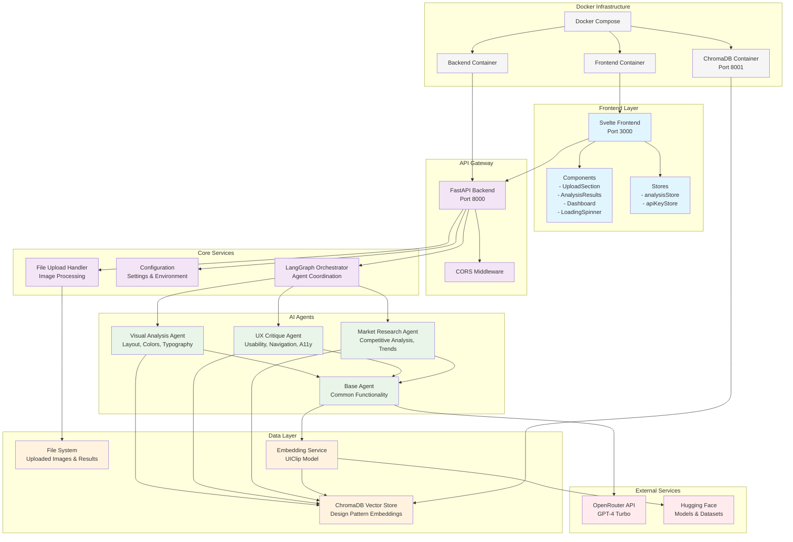
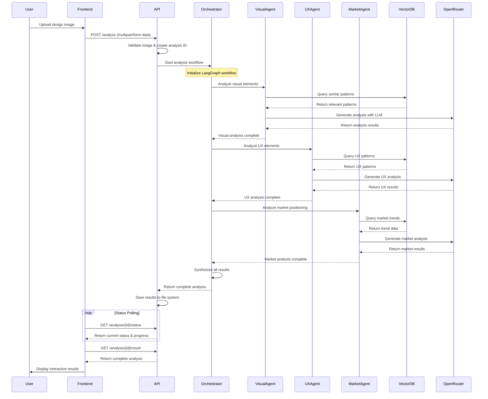
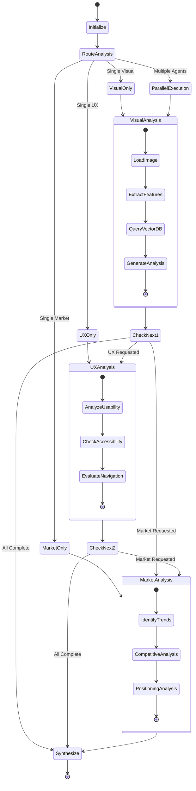
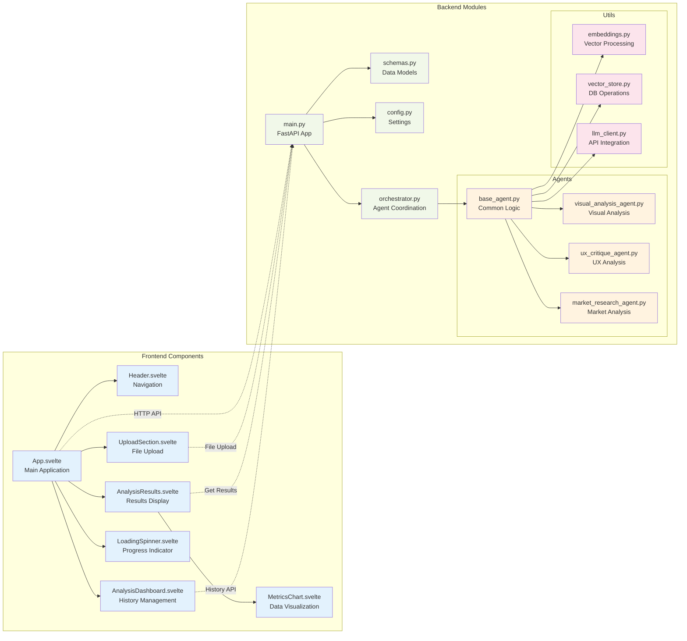
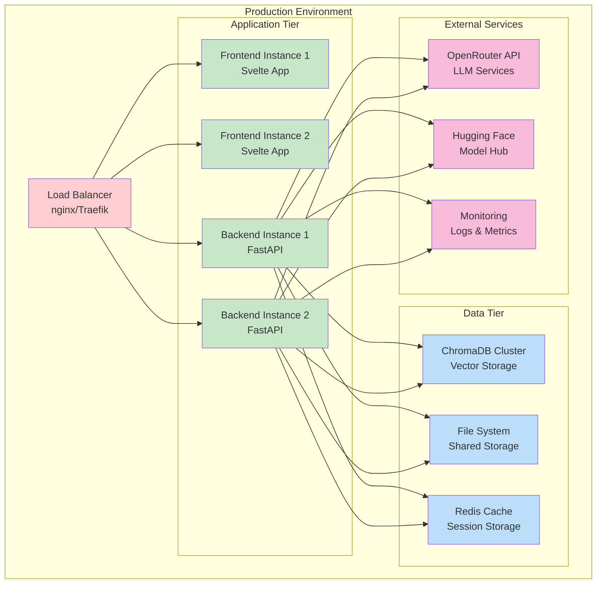
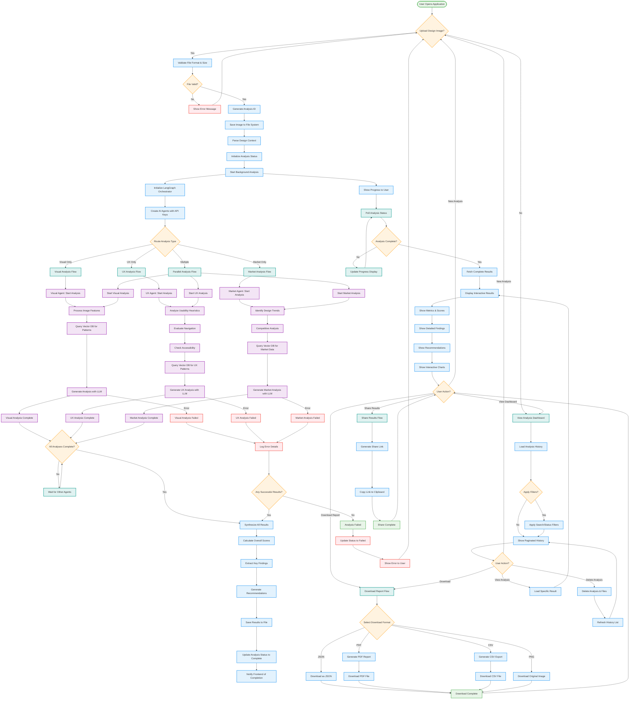

# Multimodal Design Analysis Suite - Architecture Diagram

## System Architecture Overview

## Data Flow Diagram

## Agent Workflow Diagram

## Component Architecture Diagram

## Deployment Architecture

## Complete Workflow Flowchart (Top Down)

